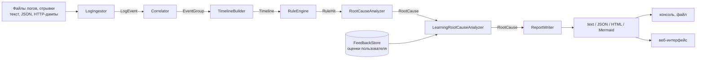
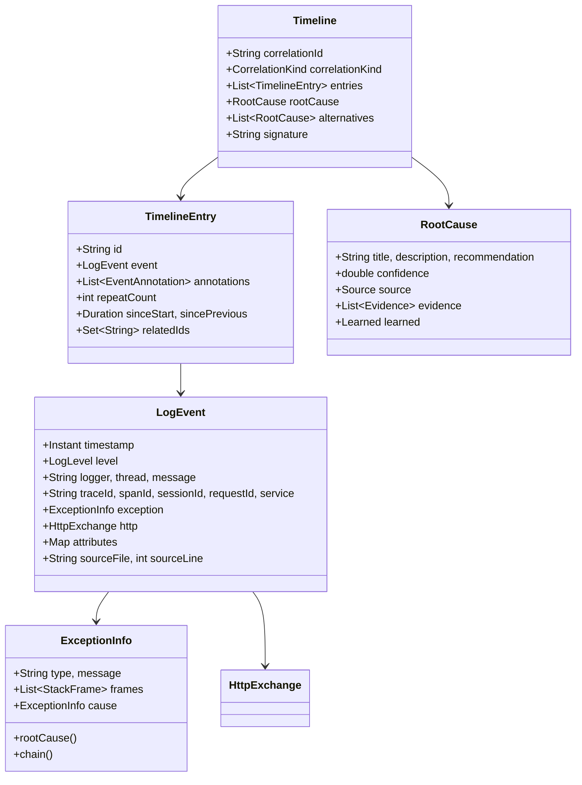
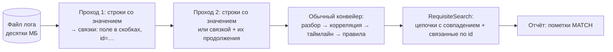
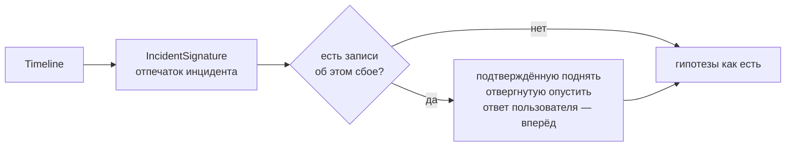

# Архитектура

## Поток данных



Каждый шаг отделён от соседних и настраивается независимо: разбор не знает о правилах,
правила не знают о формате отчёта, отчёт не знает, откуда взялись события.
Связывает всё фасад `LogAnalyzer`.

## Модули

| Модуль | Содержимое | Зависимости |
|---|---|---|
| `core` | Вся логика: модель, парсеры, корреляция, таймлайн, правила, анализ причин, отчёты. | Jackson (JSON/YAML), SLF4J |
| `cli` | Консольные команды и локальный веб-интерфейс (`cli/ui`). | `core`, picocli |

### Веб-интерфейс

`UiServer` поднимает `com.sun.net.httpserver.HttpServer` из JDK — без веб-фреймворка и без
дополнительных зависимостей. Слушает **только петлевой интерфейс**, поэтому чтение файлов
по указанному пути безопасно: обратиться к серверу может лишь тот, кто уже за этой машиной.

Маршруты:

| Маршрут | Назначение |
|---|---|
| `GET /` | страница интерфейса (`UiPage`) |
| `POST /api/analyze` | текст фрагмента или путь к файлу → отчёт в `json` / `html` / `text`; параметр `find` включает поиск по реквизиту |
| `GET /api/rules` | правила с условиями и формулировками причин — раздел «Правила» |
| `GET /api/patterns`, `POST /api/patterns` | встроенные шаблоны и проверка строки — раздел «Форматы логов» |
| `GET /api/feedback` | что анализатор запомнил из оценок пользователя — раздел «Память» |
| `POST /api/feedback` | оценка разбора: «верно», «не то», правильная версия или своя формулировка |
| `POST /api/feedback/forget` | убрать запись из памяти |

Страница запрашивает отчёт в **JSON** и рисует инциденты сама: так сводка, поиск по событиям
и карточки живут в одном документе, а состояние фильтров не теряется между запусками.
HTML-отчёт (`HtmlReportWriter`) при этом остаётся — он отдаётся по `format=html` для кнопки
«Скачать отчёт» и для команды `analyze -f html`.

`core` не зависит ни от CLI, ни от UI — это и позволит подключить его к плагину IDE без изменений.

## Пакеты `core`

```
model/      LogEvent, ExceptionInfo, HttpExchange, TimelineEntry, Timeline, RootCause, AnalysisReport
parse/      LogIngestor, LogPattern, JsonLogParser, StackTraceParser, HttpDumpParser,
            TimestampParser, AttributeExtractor, ParseOptions
correlate/  Correlator, EventGroup, CorrelationOptions
timeline/   TimelineBuilder, EventFingerprint, TimelineOptions
rules/      Rule, Condition, RuleSet, RuleEngine, RuleSetLoader
analyze/    RootCauseAnalyzer, HeuristicRootCauseAnalyzer, IncidentPromptBuilder, AnalysisOptions
search/     RequisiteSearch, RequisiteFilter
learn/      IncidentSignature, FeedbackRecord, FeedbackStore, LearningRootCauseAnalyzer
report/     JsonReportWriter, TextReportWriter, HtmlReportWriter, MermaidReportWriter
config/     AnalyzerConfig
```

## Модель данных



## Разбор: как строка становится событием

`LogIngestor` — конечный автомат с состоянием «текущая запись + её продолжение».
Для каждой строки по порядку:

1. **JSON-объект?** → `JsonLogParser` (внутри HTTP-дампа JSON считается телом ответа, а не новой записью).
2. **Начало HTTP-дампа** (`GET /x HTTP/1.1`, `HTTP/1.1 500 ...`)? → `HttpDumpParser`.
3. **Подходит текстовый шаблон?** → `LogPattern` (шаблоны применяются строго по порядку,
   от специфичных к общим — иначе общий шаблон перехватит строки, которые точнее разобрал бы специфичный).
4. **Иначе** — продолжение предыдущей записи: стек-трейс, многострочное сообщение, тело HTTP.

Когда запись завершается, её «хвост» разбирается: строки до первого признака стека уходят в сообщение,
остальные — в `StackTraceParser`. Если стек начинается сразу с кадра `at ...`, заголовком исключения
считается последняя строка сообщения — так разбирается типичный Logback-вывод, где заголовок
и стек оказываются в разных строках.

Дополнительно из текста сообщения извлекаются `traceId`, `sessionId`, `userId`, длительность
и HTTP-признаки (`AttributeExtractor`) — это нужно для приложений, где трассировку добавляли «руками».

### Встроенные шаблоны

`spring-boot-sleuth`, `spring-boot` (с блоками имени приложения и `traceId,spanId`, в том числе пустыми),
`logback` (в том числе с датой вида `10-08-2026`), `level-first-thread`, `bracketed`,
`level-thread-ref`, `ts-level-logger`, `ts-level`, `ts-only`.
Пользовательские шаблоны из конфигурации применяются **до** встроенных.

`level-thread-ref` — формат воркеров платёжного шлюза:

```
00:00:25,564  INFO RMI TCP Connection(21133)-10.122.114.6 [996997565647] - check request: account=…
```

Имя потока здесь содержит пробелы и спецсимволы, поэтому берётся «до скобки», а поле в скобках —
идентификатор обрабатываемой операции — становится ключом корреляции: по нему цепочка одного
платежа собирается сама, без сквозной трассировки.

Разбор строки-продолжения (стек-трейс, XML- или JSON-тело) стоит дороже всего, поэтому такие
строки отсеиваются по первому символу: все встроенные шаблоны начинаются с метки времени
или скобки. Проверка включается, только если этому условию отвечают и пользовательские шаблоны.

## Корреляция

Порядок признаков (`Correlator`):

1. `traceId` — самый надёжный;
2. `requestId`;
3. **активный контекст потока** — если предыдущая запись того же потока попала в цепочку
   не более чем `inheritWindowSeconds` назад. Решает две типовые проблемы: первые строки
   обработки запроса пишутся до заполнения MDC, а запись с `sessionId` не должна выпадать
   из цепочки своего запроса;
4. `sessionId`;
5. дополнительные бизнес-ключи из конфигурации (`orderId`, `paymentId`, …);
6. имя потока — с разрезом на разные инциденты по паузе `threadGapSeconds`;
7. источник (файл), если признаков нет вообще.

Надёжность признака влияет на итоговую уверенность гипотезы: вывод по цепочке, собранной
по `traceId`, весомее вывода по цепочке, собранной по имени потока (`CorrelationKind.reliability()`).

## Таймлайн

- сортировка по времени (при равенстве — по порядку чтения);
- схлопывание одинаковых событий: сравнивается «отпечаток» с нормализацией чисел, UUID
  и hex-идентификаторов, поэтому серия `Retry attempt 1..3` становится одной строкой «×3».
  Повтор ищется не только среди соседних записей, но и среди 32 последних различных в пределах
  окна дедупликации — иначе цикл опроса («запрос → ответ → снова запрос») не схлопнулся бы,
  и зависший платёж занял бы в отчёте десятки тысяч строк вместо семи;
- базовые аннотации: исключение, ошибка, предупреждение, внешний вызов, HTTP 4xx/5xx,
  медленная операция, подозрительная пауза;
- связывание HTTP-запроса с ответом;
- расчёт смещений от начала инцидента и пауз между событиями.

## Правила

Правило — это условие (`when`) и следствие: пометка события (`annotate`) и/или гипотеза о причине (`cause`).
Условие проверяет уровень, тип события, регулярные выражения по тексту и по **любому звену цепочки
исключений**, HTTP-статус, длительность и атрибуты. Блок `precededBy` добавляет условие
«раньше в этой же цепочке было событие X» — так описываются сценарии вида «ошибка после серии таймаутов».

Правила сортируются по `priority` (больше — раньше). Набор загружается из YAML/JSON;
неизвестные поля считаются ошибкой, чтобы опечатка не превращалась в молча неработающее правило.

## Анализ первопричины

`HeuristicRootCauseAnalyzer` собирает гипотезы из трёх источников:

| Источник | Что даёт |
|---|---|
| Цепочка `Caused by` | Самое глубокое звено — обычно и есть причина. Оттуда же берётся ближайший кадр прикладного кода (`applicationPackages`). |
| Сработавшие правила | Готовую формулировку, категорию, рекомендацию и базовую уверенность. Правило с `markError` признаёт событие ошибкой, даже если в логе оно записано как INFO, — иначе бизнес-отказ («провайдер отклонил операцию») не считался бы сбоем. |
| Форма таймлайна | Первая ошибка важнее последующих (каскад); таймауты, ретраи и ответы 5xx перед ошибкой объясняют, почему она произошла. |

Гипотезы, указывающие на одно событие, объединяются; уверенность корректируется надёжностью
корреляции и порогом `minConfidence`. Лучшая становится `rootCause`, остальные — `alternatives`.

Если ошибок в цепочке нет, причина **не выдумывается** — поле остаётся пустым.

## Поиск по реквизиту

Пакет `search` отвечает на вопрос «покажи всё, что связано с этим ИНН / платежом / телефоном».



**Почему два прохода.** Продолжение операции обычно не повторяет искомое значение: реквизит
абонента назван один раз в строке «Next payment», а дальше обработка идёт под идентификатором
платежа. Первый проход собирает такие связки из строк, где значение встретилось: поле корреляции
в шапке записи (`[173497766]`) и `id=…` внутри сообщения. Второй оставляет строки со значением
или связкой, прихватывая их продолжения — стек-трейсы и тела запросов, физически лежащие
отдельными строками.

**Слабые связки.** Имя потока (`[ajp-nio-8809-exec-21]`) тоже связывает записи, но обслуживает
весь день работы. Поэтому оно подключается только если по надёжным связкам отобралось меньше
5000 строк: в логе API это восстанавливает цепочку запроса целиком, а в логе воркера не тянет
за собой весь файл.

**Отбор цепочек** делает `RequisiteSearch` уже после анализа: остаются цепочки с прямым
совпадением плюс те, чей идентификатор корреляции назван в тексте найденного события —
так поиск по телефону приводит к цепочке платежа. Совпавшие события помечаются
аннотацией `MATCH`.

`RequisiteFilter` работает и без файлов — для вставленного фрагмента и потока, — а «медленный»
путь (полный разбор с последующим отбором) сохраняется для случаев, когда лог уже в памяти.

## Обучение на оценках пользователя

Пакет `learn` — надстройка над анализом причин: сначала обычный разбор, затем поправка
на то, что пользователь уже говорил о таких же инцидентах.



**Сигнатура** (`IncidentSignature`) считается по опорному событию — первой ошибке цепочки:
цепочка типов исключений, класс и метод верхнего кадра первопричины (без номера строки —
он меняется от правки к правке), логгер, сообщение и HTTP-обмен, из которых убраны числа,
идентификаторы и время. Все плейсхолдеры нормализации сводятся к одному: номер заказа не должен
менять сигнатуру от того, что в нём стало больше цифр. Результат — 12 hex-символов;
он печатается в отчётах и служит адресом записи в памяти.

**Ключ гипотезы** (`causeKey`) отличает версии внутри одного инцидента. Гипотеза от правила
опознаётся по имени правила — формулировку в правиле можно поправить, не потеряв накопленных
подтверждений; остальные — по нормализованному заголовку. Ответ пользователя всегда один
на инцидент (`taught`).

**Память** (`FeedbackStore`) — JSON-файл (`~/.log-analyzer/feedback.json`), запись атомарная,
на файл в процессе приходится один экземпляр. Испорченный файл не роняет анализ и **не
перезаписывается**: память переходит в режим «только чтение», а в отчёт добавляется
предупреждение. Файл переносим: `feedback --export/--import` складывает счётчики и берёт
более свежие формулировки — так опытом обмениваются внутри команды.

**Применение** (`LearningRootCauseAnalyzer`): подтверждённая версия попадает в «подтверждённый»
диапазон уверенности (0,80 → 0,90), отвергнутая режется в 2,5 раза за каждое «нет» и,
провалившись ниже `minConfidence`, исчезает из отчёта. Сортировка ставит сказанное человеком
впереди догадок: ответ пользователя → подтверждённая им версия → всё остальное по уверенности.
Оценки не переписывают правила: правила остаются общими и переносимыми, память — личный
слой поверх них.

## Отчёты

| Writer | Особенности |
|---|---|
| `JsonReportWriter` | Jackson, ISO-8601 время, пустые поля опускаются. |
| `TextReportWriter` | Колонки, аннотации, стеки; по одной пометке на тип, чтобы не засорять вывод. |
| `HtmlReportWriter` | Одна страница без внешних ресурсов: шкала инцидента, поиск, фильтр, раскрывающиеся стеки, светлая и тёмная темы. Весь текст из логов экранируется. |
| `MermaidReportWriter` | `gantt`-диаграмма; ошибки — `crit`, предупреждения — `active`. |

## Производительность и ограничения

- Разбор потоковый, память держит только текущую запись и её блок; события накапливаются
  в списке — на очень больших файлах имеет смысл ограничить `parse.maxEvents` или разбить ввод.
- Многострочный блок обрезается на `parse.maxMultilineLines` (по умолчанию 2000 строк).
- Регулярные выражения компилируются один раз и кэшируются в условиях правил.
- Анализ однопоточный: параллелизм не добавлялся сознательно — он усложнил бы код,
  а узкое место обычно чтение файлов.
