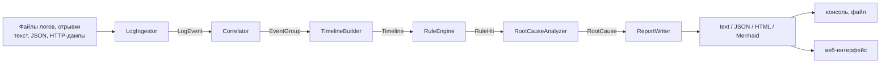
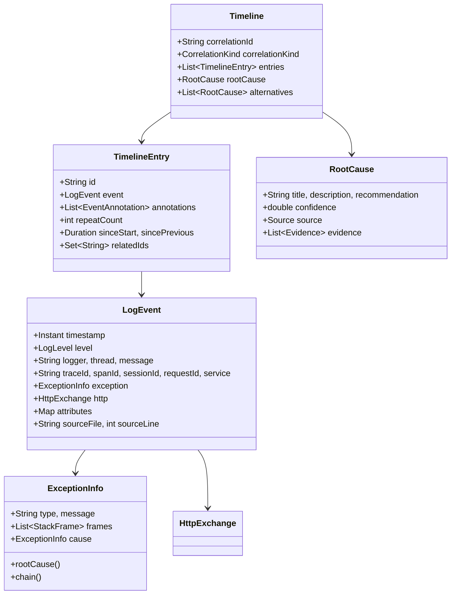

# Архитектура

## Поток данных



Каждый шаг отделён от соседних и настраивается независимо: разбор не знает о правилах,
правила не знают о формате отчёта, отчёт не знает, откуда взялись события.
Связывает всё фасад `LogAnalyzer`.

## Модули

| Модуль | Содержимое | Зависимости |
|---|---|---|
| `core` | Вся логика: модель, парсеры, корреляция, таймлайн, правила, анализ причин, отчёты. | Jackson (JSON/YAML), SLF4J |
| `cli` | Консольные команды и локальный веб-интерфейс (`cli/ui`). | `core`, picocli |

### Веб-интерфейс

`UiServer` поднимает `com.sun.net.httpserver.HttpServer` из JDK — без веб-фреймворка и без
дополнительных зависимостей. Слушает **только петлевой интерфейс**, поэтому чтение файлов
по указанному пути безопасно: обратиться к серверу может лишь тот, кто уже за этой машиной.

Два маршрута: `GET /` отдаёт страницу (`UiPage`), `POST /api/analyze` принимает текст
фрагмента или путь к файлу и возвращает отчёт (`html` / `json` / `text`). Страница показывает
HTML-отчёт во фрейме — тот самый, что генерирует `analyze -f html`, поэтому интерактив
(поиск, фильтр, раскрытие стеков) не дублируется в коде интерфейса.

`core` не зависит ни от CLI, ни от UI — это и позволит подключить его к плагину IDE без изменений.

## Пакеты `core`

```
model/      LogEvent, ExceptionInfo, HttpExchange, TimelineEntry, Timeline, RootCause, AnalysisReport
parse/      LogIngestor, LogPattern, JsonLogParser, StackTraceParser, HttpDumpParser,
            TimestampParser, AttributeExtractor, ParseOptions
correlate/  Correlator, EventGroup, CorrelationOptions
timeline/   TimelineBuilder, EventFingerprint, TimelineOptions
rules/      Rule, Condition, RuleSet, RuleEngine, RuleSetLoader
analyze/    RootCauseAnalyzer, HeuristicRootCauseAnalyzer, IncidentPromptBuilder, AnalysisOptions
report/     JsonReportWriter, TextReportWriter, HtmlReportWriter, MermaidReportWriter
config/     AnalyzerConfig
```

## Модель данных



## Разбор: как строка становится событием

`LogIngestor` — конечный автомат с состоянием «текущая запись + её продолжение».
Для каждой строки по порядку:

1. **JSON-объект?** → `JsonLogParser` (внутри HTTP-дампа JSON считается телом ответа, а не новой записью).
2. **Начало HTTP-дампа** (`GET /x HTTP/1.1`, `HTTP/1.1 500 ...`)? → `HttpDumpParser`.
3. **Подходит текстовый шаблон?** → `LogPattern` (шаблоны применяются строго по порядку,
   от специфичных к общим — иначе общий шаблон перехватит строки, которые точнее разобрал бы специфичный).
4. **Иначе** — продолжение предыдущей записи: стек-трейс, многострочное сообщение, тело HTTP.

Когда запись завершается, её «хвост» разбирается: строки до первого признака стека уходят в сообщение,
остальные — в `StackTraceParser`. Если стек начинается сразу с кадра `at ...`, заголовком исключения
считается последняя строка сообщения — так разбирается типичный Logback-вывод, где заголовок
и стек оказываются в разных строках.

Дополнительно из текста сообщения извлекаются `traceId`, `sessionId`, `userId`, длительность
и HTTP-признаки (`AttributeExtractor`) — это нужно для приложений, где трассировку добавляли «руками».

### Встроенные шаблоны

`spring-boot-sleuth`, `spring-boot` (с блоками имени приложения и `traceId,spanId`, в том числе пустыми),
`logback`, `level-first-thread`, `bracketed`, `ts-level-logger`, `ts-level`, `ts-only`.
Пользовательские шаблоны из конфигурации применяются **до** встроенных.

## Корреляция

Порядок признаков (`Correlator`):

1. `traceId` — самый надёжный;
2. `requestId`;
3. **активный контекст потока** — если предыдущая запись того же потока попала в цепочку
   не более чем `inheritWindowSeconds` назад. Решает две типовые проблемы: первые строки
   обработки запроса пишутся до заполнения MDC, а запись с `sessionId` не должна выпадать
   из цепочки своего запроса;
4. `sessionId`;
5. дополнительные бизнес-ключи из конфигурации (`orderId`, `paymentId`, …);
6. имя потока — с разрезом на разные инциденты по паузе `threadGapSeconds`;
7. источник (файл), если признаков нет вообще.

Надёжность признака влияет на итоговую уверенность гипотезы: вывод по цепочке, собранной
по `traceId`, весомее вывода по цепочке, собранной по имени потока (`CorrelationKind.reliability()`).

## Таймлайн

- сортировка по времени (при равенстве — по порядку чтения);
- схлопывание идущих подряд одинаковых событий: сравнивается «отпечаток» с нормализацией
  чисел, UUID и hex-идентификаторов, поэтому серия `Retry attempt 1..3` становится одной строкой «×3»;
- базовые аннотации: исключение, ошибка, предупреждение, внешний вызов, HTTP 4xx/5xx,
  медленная операция, подозрительная пауза;
- связывание HTTP-запроса с ответом;
- расчёт смещений от начала инцидента и пауз между событиями.

## Правила

Правило — это условие (`when`) и следствие: пометка события (`annotate`) и/или гипотеза о причине (`cause`).
Условие проверяет уровень, тип события, регулярные выражения по тексту и по **любому звену цепочки
исключений**, HTTP-статус, длительность и атрибуты. Блок `precededBy` добавляет условие
«раньше в этой же цепочке было событие X» — так описываются сценарии вида «ошибка после серии таймаутов».

Правила сортируются по `priority` (больше — раньше). Набор загружается из YAML/JSON;
неизвестные поля считаются ошибкой, чтобы опечатка не превращалась в молча неработающее правило.

## Анализ первопричины

`HeuristicRootCauseAnalyzer` собирает гипотезы из трёх источников:

| Источник | Что даёт |
|---|---|
| Цепочка `Caused by` | Самое глубокое звено — обычно и есть причина. Оттуда же берётся ближайший кадр прикладного кода (`applicationPackages`). |
| Сработавшие правила | Готовую формулировку, категорию, рекомендацию и базовую уверенность. |
| Форма таймлайна | Первая ошибка важнее последующих (каскад); таймауты, ретраи и ответы 5xx перед ошибкой объясняют, почему она произошла. |

Гипотезы, указывающие на одно событие, объединяются; уверенность корректируется надёжностью
корреляции и порогом `minConfidence`. Лучшая становится `rootCause`, остальные — `alternatives`.

Если ошибок в цепочке нет, причина **не выдумывается** — поле остаётся пустым.

## Отчёты

| Writer | Особенности |
|---|---|
| `JsonReportWriter` | Jackson, ISO-8601 время, пустые поля опускаются. |
| `TextReportWriter` | Колонки, аннотации, стеки; по одной пометке на тип, чтобы не засорять вывод. |
| `HtmlReportWriter` | Одна страница без внешних ресурсов: шкала инцидента, поиск, фильтр, раскрывающиеся стеки, светлая и тёмная темы. Весь текст из логов экранируется. |
| `MermaidReportWriter` | `gantt`-диаграмма; ошибки — `crit`, предупреждения — `active`. |

## Производительность и ограничения

- Разбор потоковый, память держит только текущую запись и её блок; события накапливаются
  в списке — на очень больших файлах имеет смысл ограничить `parse.maxEvents` или разбить ввод.
- Многострочный блок обрезается на `parse.maxMultilineLines` (по умолчанию 2000 строк).
- Регулярные выражения компилируются один раз и кэшируются в условиях правил.
- Анализ однопоточный: параллелизм не добавлялся сознательно — он усложнил бы код,
  а узкое место обычно чтение файлов.
